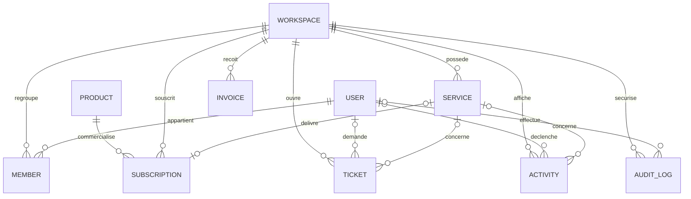

# PGYS — Modèle métier centré sur le Workspace

## 1. Introduction

PGYS est une plateforme de services numériques destinée aux indépendants, TPE,
PME et associations. Elle réunit plusieurs familles de services : cloud privé,
hébergement, sauvegardes, applications métier, maintenance et, à terme,
messagerie professionnelle.

Le modèle métier doit donc représenter un écosystème de services et non un
simple compte de stockage. Son agrégat principal est le **Workspace** : l’espace
dans lequel une organisation retrouve ses membres, ses services, ses
abonnements, ses factures, ses demandes de support et son historique.

Ce document définit le modèle cible. Il sert de référence avant toute évolution
du schéma Prisma, de l’API ou du portail. Il ne constitue ni une migration ni une
spécification d’implémentation immédiate.

## 2. Pourquoi Workspace plutôt que Customer

Le mot `Customer` décrit une relation commerciale : une personne ou une
organisation achète un service à PGYS. Cette notion est utile pour la vente et
la facturation, mais elle est insuffisante pour structurer la plateforme.

Un Workspace représente un périmètre d’usage et de responsabilité :

- il regroupe plusieurs utilisateurs avec des rôles différents ;
- il possède un ou plusieurs services PGYS ;
- il porte les abonnements et la facturation ;
- il centralise le support et les activités visibles par ses membres ;
- il forme la frontière d’isolation des données entre organisations ;
- il reste stable même si le contact commercial ou le propriétaire change.

Cette distinction répond à plusieurs cas réels. Un utilisateur peut appartenir
à plusieurs organisations. Une association peut changer de président sans
changer d’espace. Un prestataire peut intervenir dans plusieurs Workspaces. Une
entreprise peut utiliser plusieurs produits PGYS sous un même espace.

Dans le modèle cible, `Workspace` remplace donc `Customer` comme racine du
domaine applicatif. Le terme « client » peut rester employé dans les documents
commerciaux ou désigner un contact de facturation, mais il ne doit plus servir
de frontière technique multi-tenant.

## 3. Entités principales

### Workspace

Le Workspace représente l’espace numérique d’une organisation cliente.

Responsabilités principales :

- définir le périmètre d’isolation des données ;
- regrouper les membres et leurs rôles ;
- posséder les services, abonnements, factures et tickets ;
- porter les informations d’organisation et de facturation ;
- disposer d’un statut de cycle de vie.

Attributs indicatifs : identifiant, nom, slug, statut, raison sociale éventuelle,
coordonnées de facturation, langue, fuseau horaire, dates de création et de mise
à jour.

### Member

Le Member matérialise l’appartenance d’un User à un Workspace. Il ne représente
pas une identité autonome.

Responsabilités principales :

- associer un utilisateur à un Workspace ;
- définir son rôle dans cet espace ;
- suivre l’état de son invitation ou de son accès ;
- conserver les dates d’entrée, de dernière activité et de révocation.

La combinaison `workspaceId` et `userId` doit être unique. Un même User peut
posséder des rôles différents dans plusieurs Workspaces.

### User

Le User représente une identité humaine globale dans PGYS.

Responsabilités principales :

- porter l’identité de connexion ;
- conserver les informations personnelles minimales ;
- être relié à un ou plusieurs Workspaces par des Members ;
- être identifié comme auteur d’actions ou de tickets.

L’adresse email est rattachée au User et doit être unique selon la stratégie
d’identité retenue. Les droits ne sont jamais portés directement par le User :
ils dépendent de son Member dans le Workspace courant.

### Service

Le Service représente une instance opérationnelle fournie à un Workspace.

Exemples : un espace PGYS Cloud, un site hébergé, une politique de sauvegarde ou
une application métier donnée.

Responsabilités principales :

- identifier la nature du service ;
- suivre son état opérationnel ;
- conserver sa configuration métier non secrète ;
- être relié au produit souscrit ;
- exposer les informations utiles au portail client.

Un Service ne doit contenir aucun secret d’infrastructure. Les identifiants
techniques externes, lorsqu’ils deviendront nécessaires, devront être limités,
tracés et séparés des informations sensibles.

### Product

Le Product décrit une offre commercialisable du catalogue PGYS.

Exemples : PGYS Cloud Essentiel, une offre d’hébergement managé ou un forfait de
maintenance.

Responsabilités principales :

- définir un code stable, un nom et une description ;
- indiquer le type de service délivré ;
- porter les caractéristiques commerciales et limites de l’offre ;
- permettre l’évolution du catalogue sans modifier les services existants.

Le Product est un modèle de catalogue. Le Service est l’instance réellement
fournie au Workspace.

### Subscription

La Subscription représente l’engagement commercial d’un Workspace pour un
Product.

Responsabilités principales :

- relier un Workspace à un Product ;
- conserver la période, le tarif convenu et la devise ;
- suivre le statut de l’abonnement ;
- référencer le Service délivré lorsque celui-ci existe ;
- conserver un instantané des conditions commerciales utiles à l’historique.

La modification future d’un Product ne doit pas altérer rétroactivement une
Subscription existante.

### Invoice

L’Invoice représente une pièce de facturation adressée à un Workspace.

Responsabilités principales :

- porter un numéro unique et immuable ;
- conserver les montants, la devise et les échéances ;
- suivre son statut de règlement ;
- conserver les coordonnées de facturation applicables à la date d’émission ;
- référencer les abonnements ou prestations facturés.

La facturation automatique n’est pas requise au MVP. L’entité doit néanmoins
être conçue indépendamment d’un prestataire de paiement.

### Ticket

Le Ticket représente une demande de support d’un Workspace.

Responsabilités principales :

- porter un sujet, une description, une priorité et un statut ;
- identifier le demandeur et le Workspace ;
- référencer éventuellement un Service ;
- conserver les dates de création, de réponse et de résolution ;
- permettre le suivi par le portail et l’administration PGYS.

Un Ticket appartient toujours à un Workspace, même s’il est créé par un agent
PGYS pour le compte du client.

### Activity

L’Activity représente un événement métier compréhensible et visible dans le
portail.

Exemples : service activé, quota modifié, sauvegarde vérifiée, ticket résolu.

Responsabilités principales :

- alimenter le fil d’activité du Workspace ;
- décrire un événement avec un vocabulaire utilisateur ;
- référencer éventuellement un User, un Service ou un Ticket ;
- porter des métadonnées non sensibles utiles à l’affichage.

Une Activity est orientée produit. Elle peut être masquée ou regroupée pour
améliorer la lisibilité du portail.

### AuditLog

L’AuditLog représente une trace de sécurité et de conformité, distincte de
l’Activity.

Responsabilités principales :

- enregistrer les actions sensibles et leurs auteurs ;
- conserver la cible, le résultat et la date de l’action ;
- permettre l’investigation d’un incident ;
- rester immuable et soumis à une politique de rétention ;
- ne jamais contenir de secret ou de donnée personnelle inutile.

Un AuditLog est orienté contrôle interne. Il n’est pas nécessairement visible
par les membres du Workspace et ne doit pas être modifié après création.

## 4. Relations entre les entités



| Relation | Cardinalité | Règle |
| --- | --- | --- |
| Workspace — Member | 1 à plusieurs | Un Workspace actif possède au moins un OWNER |
| User — Member | 1 à plusieurs | Un User peut appartenir à plusieurs Workspaces |
| Workspace — Service | 1 à plusieurs | Un Service n’appartient qu’à un Workspace |
| Product — Subscription | 1 à plusieurs | Une Subscription référence un Product du catalogue |
| Workspace — Subscription | 1 à plusieurs | L’engagement commercial est porté par le Workspace |
| Subscription — Service | 0 ou 1 à 0 ou 1 | Le provisionnement peut être différé ou absent |
| Workspace — Invoice | 1 à plusieurs | Une facture ne mélange jamais plusieurs Workspaces |
| Workspace — Ticket | 1 à plusieurs | Le Workspace reste obligatoire, le Service est optionnel |
| Workspace — Activity | 1 à plusieurs | L’activité visible reste isolée par Workspace |
| Workspace — AuditLog | 1 à plusieurs | Toute action sensible est rattachée à son périmètre |

## 5. Types de services

Le type d’un Service est une valeur métier stable :

| Type | Description |
| --- | --- |
| `CLOUD` | Stockage, synchronisation et partage de fichiers PGYS Cloud |
| `HOSTING` | Hébergement de sites, applications ou services |
| `BACKUP` | Sauvegarde externalisée, vérification et restauration |
| `APP` | Application métier standard ou personnalisée |
| `MAINTENANCE` | Maintenance, supervision et accompagnement récurrent |
| `MAIL` | Messagerie professionnelle et services associés |

Ces types décrivent la famille fonctionnelle. Les variantes commerciales sont
définies par les Products, et non par l’ajout de nouveaux types techniques.

## 6. Rôles

Les rôles sont portés par Member et s’appliquent uniquement dans son Workspace.

| Rôle | Responsabilités |
| --- | --- |
| `OWNER` | Contrôle complet, gestion des administrateurs et décisions sensibles |
| `ADMIN` | Gestion courante des membres, services, tickets et paramètres |
| `MEMBER` | Utilisation des services autorisés et création de tickets |
| `VIEWER` | Consultation sans modification des informations accessibles |

Principes d’autorisation :

- un Workspace actif doit toujours conserver au moins un OWNER ;
- le dernier OWNER ne peut pas quitter le Workspace ou être rétrogradé ;
- un ADMIN ne peut pas attribuer un droit supérieur au sien ;
- les permissions détaillées pourront compléter les rôles sans les remplacer ;
- le rôle PGYS interne d’un opérateur ne doit pas être confondu avec un rôle de
  Member client.

## 7. Cycle de vie d’un Workspace

Cycle cible :

```text
DRAFT -> ACTIVE -> SUSPENDED -> ACTIVE
                  |
                  v
               CLOSING -> CLOSED
```

### DRAFT

Le Workspace est en préparation. Les informations peuvent être complétées, mais
aucun service client ne doit être considéré comme opérationnel.

### ACTIVE

Le Workspace est utilisable. Ses membres peuvent accéder aux fonctions permises
par leurs rôles et aux Services actifs.

### SUSPENDED

Les accès ou certaines opérations sont temporairement restreints. La suspension
doit être motivée, tracée et réversible. Les données ne sont pas supprimées.

### CLOSING

La fermeture est demandée. Les nouveaux engagements sont bloqués et les
Services sont arrêtés selon une procédure contrôlée. Les exports, délais de
conservation et obligations contractuelles doivent être vérifiés.

### CLOSED

Le Workspace n’est plus utilisable. Les données résiduelles suivent les durées
de rétention documentées avant anonymisation ou suppression définitive.

Les transitions sensibles doivent créer un AuditLog et, lorsqu’elles sont
pertinentes pour le client, une Activity.

## 8. Cycle de vie d’un Service

Cycle cible :

```text
REQUESTED -> PROVISIONING -> ACTIVE -> DEGRADED -> ACTIVE
                              |
                              v
                          SUSPENDED -> ACTIVE
                              |
                              v
                         TERMINATING -> TERMINATED
```

### REQUESTED

Le besoin est enregistré, mais aucune ressource n’est encore créée.

### PROVISIONING

La mise en service est en cours. Les opérations doivent être idempotentes afin
d’éviter la création de ressources en double.

### ACTIVE

Le Service est fourni et utilisable selon ses conditions contractuelles.

### DEGRADED

Le Service reste partiellement disponible, mais une anomalie affecte son niveau
de service. Cet état ne doit pas être utilisé pour une simple maintenance
planifiée sans impact.

### SUSPENDED

Le Service est temporairement désactivé sans suppression de ses données. La
raison et l’auteur de la suspension doivent être tracés.

### TERMINATING

La résiliation est en cours. Les sauvegardes, exports et délais contractuels
doivent être appliqués avant suppression.

### TERMINATED

Le Service n’est plus fourni. Son historique commercial et ses traces d’audit
sont conservés selon les politiques applicables.

## 9. Règles métier

1. Toute donnée métier locataire doit être rattachée à un Workspace.
2. Une requête ne doit jamais accéder aux données d’un autre Workspace.
3. Un User n’obtient des droits qu’au travers d’un Member actif.
4. Un Workspace actif conserve toujours au moins un Member avec le rôle OWNER.
5. Le slug d’un Workspace est unique et stable ; son changement est une
   opération contrôlée.
6. Un Service appartient à un seul Workspace et possède un type immuable après
   son activation.
7. Un Product peut évoluer, mais une Subscription conserve les conditions
   commerciales acceptées lors de la souscription.
8. Une Invoice émise est immuable. Toute correction passe par un document
   comptable complémentaire, jamais par l’écrasement silencieux des montants.
9. Un Ticket appartient obligatoirement à un Workspace ; le Service concerné
   reste optionnel.
10. Une Activity ne contient que des informations compréhensibles et non
    sensibles destinées au portail.
11. Un AuditLog est immuable, horodaté et créé pour chaque action sensible.
12. Les suppressions de Workspace, Member, Service et User respectent les règles
    de conservation, de facturation, de support et de sécurité.
13. Aucun secret d’infrastructure, mot de passe ou jeton n’est stocké dans les
    entités métier générales.
14. Les dates métier sont enregistrées en UTC et présentées selon le fuseau du
    Workspace.

## 10. Impacts sur Prisma

Le schéma Prisma actuel utilise `Customer` comme racine. Son évolution devra
être préparée par une migration dédiée et revue séparément. Ce document ne la
réalise pas.

Évolutions recommandées :

- remplacer progressivement `Customer` par `Workspace`, sans perte des
  identifiants ni des relations existantes ;
- séparer `User` de l’organisation et créer la table de jointure `Member` avec
  une contrainte unique sur `(workspaceId, userId)` ;
- ajouter les rôles `OWNER`, `ADMIN`, `MEMBER` et `VIEWER` au niveau de Member ;
- ajouter `Product` et relier Subscription au Product et au Workspace ;
- rattacher Service, Invoice, Ticket, Activity et AuditLog à `workspaceId` ;
- ajouter `AuditLog` comme modèle append-only distinct d’Activity ;
- harmoniser le type de service actuel vers `CLOUD`, `HOSTING`, `BACKUP`, `APP`,
  `MAINTENANCE` et `MAIL` ;
- ajouter les statuts de cycle de vie documentés après validation des besoins
  opérationnels ;
- créer des index sur les clés de Workspace et des contraintes uniques
  composites lorsque l’unicité est propre à un Workspace ;
- définir explicitement les comportements `onDelete` afin d’éviter toute
  suppression en cascade non maîtrisée ;
- conserver les montants monétaires en `Decimal` avec une devise explicite ;
- prévoir des champs de suppression logique ou d’archivage lorsque la rétention
  interdit une suppression immédiate.

La transition devrait être découpée : ajout des nouveaux modèles, reprise des
données, double lecture temporaire si nécessaire, bascule de l’API, puis retrait
de l’ancien modèle. Chaque étape devra être réversible et sauvegardée.

## 11. Impacts sur l’API

L’API devra rendre le Workspace explicite dans ses contrats et dans son contrôle
d’accès.

Routes cibles indicatives :

```text
GET    /workspaces
GET    /workspaces/:workspaceId
GET    /workspaces/:workspaceId/members
POST   /workspaces/:workspaceId/members
GET    /workspaces/:workspaceId/services
GET    /workspaces/:workspaceId/subscriptions
GET    /workspaces/:workspaceId/invoices
GET    /workspaces/:workspaceId/tickets
POST   /workspaces/:workspaceId/tickets
GET    /workspaces/:workspaceId/activities
```

Principes d’API :

- résoudre le Workspace courant avant toute opération locataire ;
- vérifier l’appartenance et le rôle du Member lorsque l’authentification sera
  ajoutée ;
- filtrer chaque requête Prisma par `workspaceId`, même lorsque l’identifiant de
  la ressource semble unique ;
- ne jamais accepter un `workspaceId` du corps sans le confronter au contexte
  autorisé ;
- utiliser des DTOs distincts pour la création, la mise à jour et la réponse ;
- exposer des erreurs explicites sans révéler l’existence d’une ressource d’un
  autre Workspace ;
- rendre idempotentes les opérations de provisionnement et de résiliation ;
- créer les Activity et AuditLog dans la même transaction que l’action métier
  lorsque la cohérence l’exige ;
- prévoir la pagination des membres, services, tickets, activités et journaux ;
- conserver temporairement les routes `/customers` uniquement si une stratégie
  de compatibilité est nécessaire, avec une dépréciation documentée.

## 12. Évolutions futures

Le modèle pourra évoluer sans remettre en cause le rôle central du Workspace :

- permissions fines en complément des rôles ;
- groupes de membres et équipes internes ;
- accès invité limité dans le temps ;
- opérateurs PGYS intervenant sur plusieurs Workspaces avec délégation tracée ;
- contacts de facturation multiples ;
- lignes de facture, avoirs et taxes ;
- catalogue de Products versionné ;
- dépendances entre Services, par exemple une application liée à un hébergement ;
- quotas et mesures d’usage ;
- contrats et niveaux de service ;
- notifications et préférences par Member ;
- fédération d’identité et authentification multifacteur ;
- archivage légal et politiques de rétention configurables ;
- événements de domaine pour le provisionnement asynchrone ;
- portail multi-Workspace pour les utilisateurs appartenant à plusieurs
  organisations.

Ces évolutions doivent rester proportionnées aux besoins réels. Le Workspace,
le Member et la séparation entre Product, Subscription et Service constituent
le socle à stabiliser avant d’ajouter de nouvelles abstractions.
